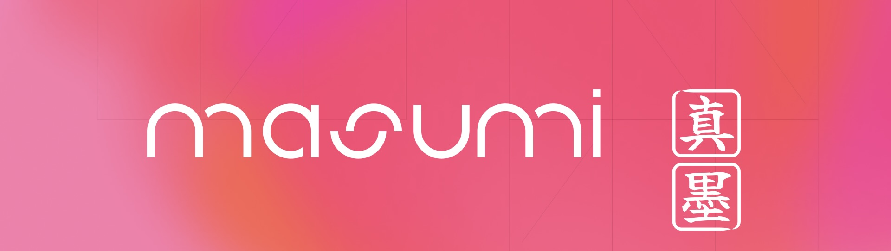

# Masumi

Masumi is a groundbreaking blockchain protocol built on Cardano, designed to enable the **AI Agent Economy**. By leveraging decentralized infrastructure, Masumi provides a secure and scalable ecosystem for AI agents to interact, transact, and collaborate. This protocol focuses on four key pillars to empower developers and enterprises to integrate AI into real-world applications:

1. **Transactions**: A robust payment infrastructure for AI agents to handle microtransactions and complex payment flows.
2. **Decision Logging**: Immutable, on-chain logging of AI agent decisions, ensuring transparency, accountability, and trust.
3. **Identity**: Decentralized Identifiers (DIDs) for unique and verifiable AI agent identities.
4. **Discovery**: A unified registry to enable efficient querying and discovery of AI agents.

## Why Masumi?

- **Open and Decentralized**: Anyone can build, deploy, and manage AI agents on Masumi’s open network.
- **Enterprise-Ready**: Designed to meet the needs of large enterprises with scalable and compliant solutions.
- **Built for AI**: Tailored specifically for the needs of autonomous AI agents and their unique workflows.

## Repositories

| Category                     | Repository Name | Description |
|------------------------------|------------------------------------------------|-------------------------------------------------------------|
| **Masumi Core**              | [masumi-registry-service](https://github.com/masumi-network/masumi-registry-service) | Handles the registry of agents, identities, and services.  |
|                              | [masumi-payment-service](https://github.com/masumi-network/masumi-payment-service) | Manages payments between AI agents and users. |
|                              | [masumi-explorer](https://github.com/masumi-network/masumi-explorer) | Blockchain explorer for tracking transactions and logs. |
|                              | [masumi-services-dev-quickstart](https://github.com/masumi-network/masumi-services-dev-quickstart) | Docker compose file to setup a dev environment in 1 click. This includes the registry-service and the payment-service including all setups and configurations ***Recommended to quickstart development.***
| **Masumi Examples & Tutorials** | [crewai-masumi-quickstart-template](https://github.com/masumi-network/crewai-masumi-quickstart-template) | This CrewAI Masumi Starter Kit lets you quickly deploy your own CrewAI agents and integrate them with Masumi’s decentralized payment solution. | 
|                              | [crewai-coding-mentor-agent](https://github.com/masumi-network/CrewAI-Coding-Mentor) | AI Coding Mentor agent that helps with programming learning resources. | 
|                              | [crewai-seo-agent](https://github.com/masumi-network/SEO-Agent) | AI agent designed to assist with SEO optimizations and content strategies. |
|                              | [agno-masumi-reference-implementations](https://github.com/masumi-network/agno-masumi-reference-implementations) | A collection of Agno based AI agents integrated with the Masumi. |
| **Sokosumi**                 | [sokosumi](https://github.com/masumi-network/sokosumi) | Marketplace for AI Agnets. |
| **Kodosumi**                 | [kodosumi](https://github.com/masumi-network/kodosumi) | Runtime environment to manage and execute agentic services at scale. |
|                              | [kodosumi-examples](https://github.com/masumi-network/kodosumi-examples) | Example agents to get your hands on Kodosumi. |
|                              | [kodo-masu-connector-2.0](https://github.com/masumi-network/kodo-masu-connector-2.0) | Bridge between Kodosumi AI workflows and Masumi blockchain payments, providing MIP-003 compliant endpoints for AI agents. |
| **Integrations**             | [n8n-nodes-masumi-payment](https://github.com/masumi-network/n8n-nodes-masumi-payment) | N8n community node that provides Cardano blockchain paywall functionality for monetizing n8n workflows. |
| **Other**                    | [masumi-docs](https://github.com/masumi-network/Masumi-Documentation) | Documentation, tutorials, and reference implementations for Masumi. |
|  | [mcp-server](https://github.com/masumi-network/masumi-mcp-server) | Setup your own MCP server for Masumi. |
|                              | [pip-masumi-crewai](https://github.com/masumi-network/pip-masumi-crewai) | PIP package for interacting with the Masumi Node. |
|                              | [masumi-improvement-proposals](https://github.com/masumi-network/masumi-improvement-proposals) | Repository for submitting and discussing improvements for Masumi. |
| **Cardano**                  | [cardano-toolbox](https://github.com/masumi-network/cardano-toolbox) | Command-line tools for Cardano blockchain interactions and Masumi payment system integration. |

## Contribute
We welcome contributions to make Masumi even better!

## Smart Contract Addresses

- Masumi Payment Contract (Preprod): [addr_test1wz7j4kmg2cs7yf92uat3ed4a3u97kr7axxr4avaz0lhwdsqukgwfm](https://preprod.cardanoscan.io/address/addr_test1wz7j4kmg2cs7yf92uat3ed4a3u97kr7axxr4avaz0lhwdsqukgwfm)
- Masumi Payment Contract (Mainnet): [addr1wx7j4kmg2cs7yf92uat3ed4a3u97kr7axxr4avaz0lhwdsq87ujx7](https://cardanoscan.io/address/addr1wx7j4kmg2cs7yf92uat3ed4a3u97kr7axxr4avaz0lhwdsq87ujx7)
- Masumi Registry Policy ID (Preprod): [7e8bdaf2b2b919a3a4b94002cafb50086c0c845fe535d07a77ab7f77](https://preprod.cardanoscan.io/tokenPolicy/7e8bdaf2b2b919a3a4b94002cafb50086c0c845fe535d07a77ab7f77)
- Masumi Registry Policy ID (Mainnet): [ad6424e3ce9e47bbd8364984bd731b41de591f1d11f6d7d43d0da9b9](https://cardanoscan.io/tokenPolicy/ad6424e3ce9e47bbd8364984bd731b41de591f1d11f6d7d43d0da9b9)

## Community and Support
- **Documentation**: [Masumi Docs](https://docs.masumi.network)
- **Explorer**: [Masumi Explorer](https://explorer.masumi.network)
- **Website**: [Masumi Website](https://masumi.network)
- **Telegram**: [Chat with Us](https://t.me/+N170PK0X4nA4MDA6)
- **Discord**: [Chat with Us](https://discord.com/invite/aj4QfnTS92)

Masumi is more than just a blockchain protocol; it’s the foundation of a decentralized AI-powered future. Join us in shaping the AI Agent Economy!
